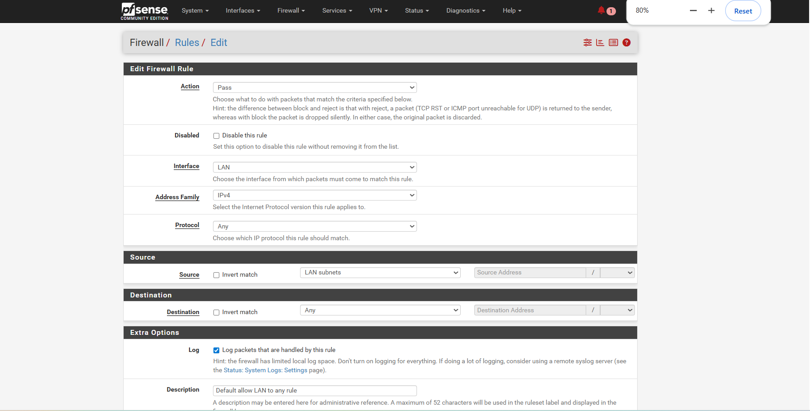

# pfSense Firewall Configuration

## Ziel / Objective

Dieses Dokument beschreibt die Konfiguration der pfSense Firewall im SOC Detection & Incident Response Lab.

The purpose of this document is to describe the pfSense firewall configuration used in the SOC Detection & Incident Response Lab.

---

## 1. Remote Logging aktivieren / Enable Remote Logging

### Schritt / Step

Navigate to:

Status → System Logs → Settings

Remote logging was enabled to forward pfSense logs to the Wazuh server.

### Configuration

| Setting | Value |
|---|---|
| Remote Logging | Enabled |
| Syslog Server | 192.168.56.13 |
| Port | 514 |
| Protocol | UDP |
| Log Types | Firewall Events, System Events, DHCP, DNS |

### Screenshot


---

## 2. Firewall Rule Logging aktivieren / Enable Rule Logging

### Schritt / Step

Navigate to:

Firewall → Rules → LAN

The rule **Default allow LAN to any rule** was edited.

The option below was enabled:

`Log packets that are handled by this rule`

### Purpose

This allows pfSense to generate firewall logs for traffic passing through the LAN interface.

### Screenshot



---

## Ergebnis / Result

pfSense successfully forwarded firewall logs to the Wazuh server.

Example log pattern:

```text
filterlog: match,block
