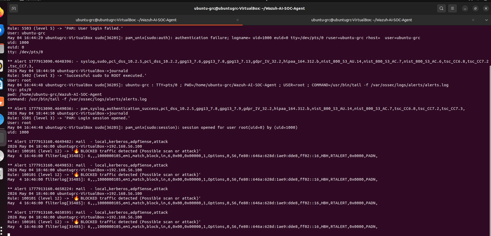

# 📡 Live Alert Monitoring in Wazuh

## 🎯 Objective

This document demonstrates real-time monitoring of security alerts using Wazuh SIEM.

Dieses Dokument zeigt die Echtzeitüberwachung von Sicherheitsereignissen mit Wazuh SIEM.

---

## 🛠️ Command Used

```bash
sudo tail -f /var/ossec/logs/alerts/alerts.log
```

### Explanation

* `tail -f` → Displays logs in real time
* `/var/ossec/logs/alerts/alerts.log` → Wazuh alert log file

👉 This allows continuous monitoring of security events as they occur.

---

## 📊 Observed Security Events

### 1. ❌ Failed Authentication

```text
Rule: 5503 (Level 5)
Description: PAM: User login failed
```

**Meaning:**

* A login attempt failed
* Could indicate incorrect password or brute-force attempt

---

### 2. 🔐 Sudo Authentication Failure

```text
pam_unix(sudo:auth): authentication failure
```

**Meaning:**

* User attempted to use sudo but failed authentication
* Possible misuse or incorrect privilege escalation attempt

---

### 3. ✅ Successful Privilege Escalation

```text
Rule: 5402 (Level 3)
Description: Successful sudo to ROOT executed
```

**Meaning:**

* User successfully executed a sudo command
* Elevated privileges granted

---

### 4. 🟢 Session Opened

```text
Rule: 5501 (Level 3)
Description: PAM: Login session opened
```

**Meaning:**

* A new session was created
* Indicates successful authentication

---

## 🔍 Security Analysis

These events demonstrate:

* Authentication attempts (success and failure)
* Privilege escalation activity (sudo)
* User session tracking

👉 This is critical for detecting:

* Brute-force attacks
* Unauthorized access
* Privilege escalation

---

## ⚠️ Risk Considerations

| Event             | Risk                        |
| ----------------- | --------------------------- |
| Failed login      | Medium                      |
| Multiple failures | High (possible brute force) |
| Sudo usage        | Medium                      |
| Root access       | High                        |

---

## 🛡️ Recommended Actions

* Monitor repeated failed login attempts
* Enable account lockout policies
* Implement Multi-Factor Authentication (MFA)
* Restrict sudo privileges
* Audit user activity regularly

---

## 📸 Evidence



---

## ✅ Conclusion

Real-time monitoring using Wazuh provides visibility into:

* Authentication events
* Privilege escalation attempts
* User activity

This capability is essential for SOC operations and incident detection.

---

## 🔗 Compliance Mapping

* **ISO 27001**: A.12 (Logging), A.9 (Access Control)
* **NIST**: AU-6 (Audit Review), AC-6 (Least Privilege)
* **MITRE ATT&CK**:

  * T1078 (Valid Accounts)
  * T1068 (Privilege Escalation)
