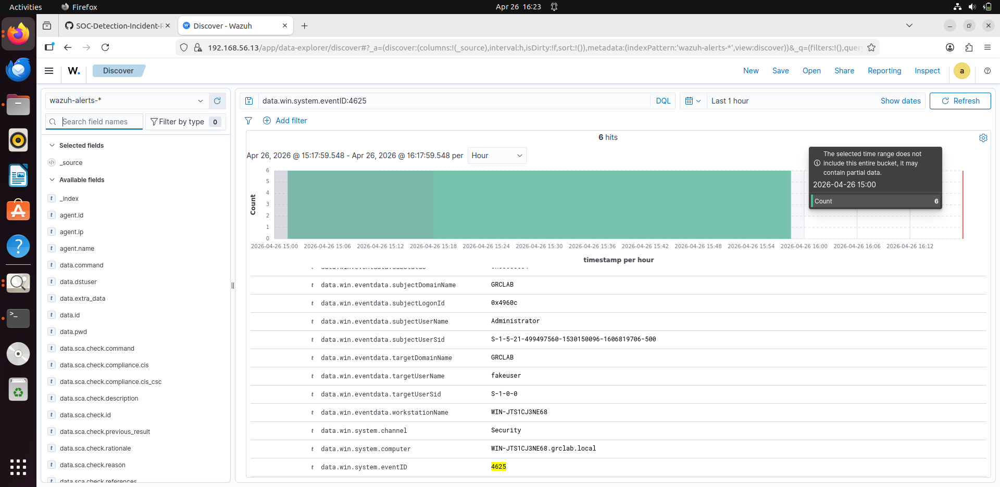

# 🚨 Wazuh Alert Analysis – Brute Force Angriff (RDP)

## 📌 Überblick

Während der Brute-Force-Angriffssimulation auf den Windows Server wurden mehrere sicherheitsrelevante Ereignisse im SIEM (Wazuh) erkannt.

---

## 🔍 Erkannte Events

### ❌ Fehlgeschlagene Anmeldeversuche

- **Event ID:** 4625  
- **Beschreibung:** Failed Logon  
- **Bedeutung:** Mehrere fehlgeschlagene Login-Versuche deuten auf einen möglichen Brute-Force-Angriff hin  

📸 

---

### ✅ Erfolgreiche Anmeldung

- **Event ID:** 4624  
- **Beschreibung:** Successful Logon  
- **Bedeutung:** Der Angreifer konnte sich erfolgreich anmelden  

📸 *Screenshot einfügen: Wazuh Alert 4624*

---

## ⚠️ Analyse

Die Analyse zeigt ein typisches Muster eines Brute-Force-Angriffs:

- Hohe Anzahl fehlgeschlagener Login-Versuche  
- Gleiche Quell-IP-Adresse  
- Unterschiedliche Passwörter  
- Anschließender erfolgreicher Login  

---

## 🧠 Bewertung (Triage)

- **Severity:** Hoch  
- **Bedrohung:** Unautorisierter Zugriff möglich  
- **Risiko:** Kompromittierung des Systems  

---

## 🛠️ Empfohlene Maßnahmen

- Konto sperren nach mehreren Fehlversuchen  
- Passwort zurücksetzen  
- MFA aktivieren  
- RDP-Zugriff einschränken  
- SIEM Alerts weiter optimieren  

---

## 📊 MITRE ATT&CK Mapping

- **Technique:** T1110 – Brute Force  
