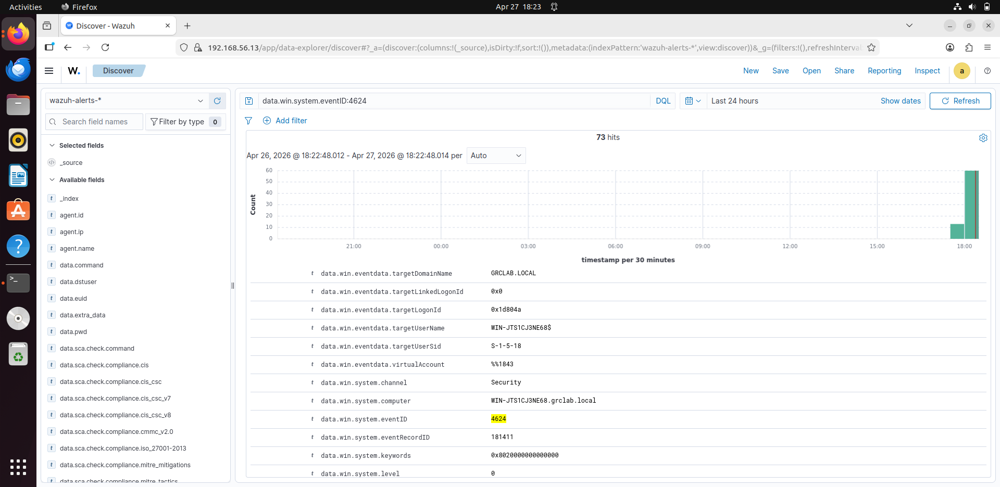

# Successful Login Detection (Event ID 4624)

A successful login event was recorded on the Windows system.

## Details:

- Event ID: 4624
- Description: Successful logon
- Detection Source: Wazuh SIEM
- Severity: Low

## Analysis

This event represents a successful authentication to the system.  
It is important to monitor these events to detect unusual login patterns or unauthorized access.

## MITRE ATT&CK Mapping

- Technique: T1078 – Valid Accounts

## Evidence

